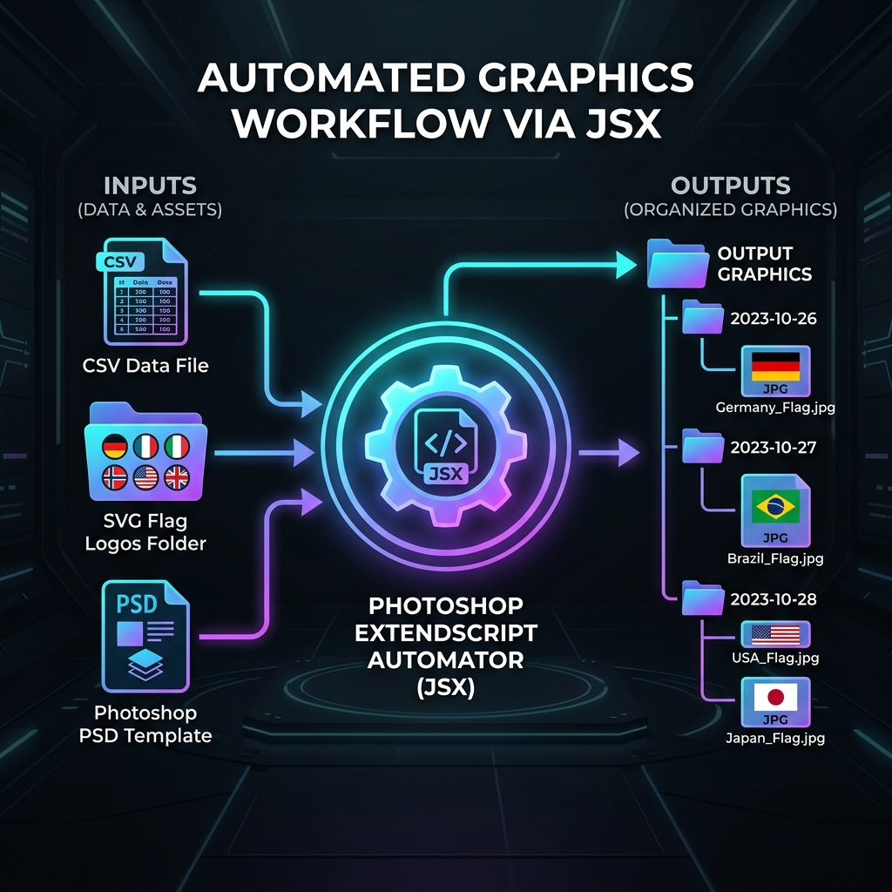

# Automasi Jadwal Lengkap Photoshop (V7 - Optimized)



Alat automasi berbasis **Photoshop ExtendScript (.jsx)** dan **Python** untuk men-generate grafik jadwal pertandingan olahraga secara massal (bulk) menggunakan data terstruktur dari file CSV dan aset gambar bendera/logo (SVG).

Proyek ini sangat berguna bagi desainer grafis atau admin media sosial olahraga untuk memproduksi puluhan banner jadwal pertandingan hanya dalam hitungan detik tanpa perlu mengubah teks dan logo secara manual satu per satu.

---

## 🌟 Fitur Utama

1. **Super Fast Layer Caching:** Pencarian layer di Photoshop menggunakan sistem *caching* memori ($O(1)$) sehingga proses ekspor berjalan sangat cepat tanpa membebani kinerja CPU.
2. **Auto-Revert History State:** Setelah ekspor JPG selesai, kondisi template PSD Anda di layar Photoshop akan otomatis kembali bersih ke kondisi semula. Anda tidak perlu melakukan *undo* manual.
3. **Auto Folder Organizer:** Photoshop akan mendeteksi tanggal pertandingan dan secara otomatis membuat subfolder tanggal (misalnya `13 Juni 2026/`) di dalam direktori ekspor untuk menyimpan file JPG yang sesuai.
4. **Missing Logo Reporter:** Menyajikan laporan di akhir ekspor jika ada logo bendera/tim yang ditulis di CSV namun belum tersedia di folder logo.
5. **UTF-8 Safe Encoding:** Menjamin pembacaan huruf dengan karakter khusus/aksen (seperti `Curaçao`, `Cote d'Ivoire`) tidak akan rusak di Photoshop.
6. **Execution Timer:** Menampilkan durasi waktu yang dihabiskan untuk menyelesaikan seluruh proses automasi.
7. **Duplicate Safe (Python Utility):** Dilengkapi dengan utilitas Python pembantu yang aman dari tindihan berkas duplikat jika Anda ingin merapikan folder secara terpisah.

---

## 📁 Struktur Direktori Proyek

```text
├── AutoJadwalLengkap.jsx                      # Script utama automasi Photoshop (ExtendScript)
├── Hari,Tgl WIB,Jam WIB,Tim 1,Tim 2,Logo 1,.csv  # Contoh file data jadwal (CSV)
├── Peta/                                      # Folder penyimpanan aset logo bendera (.svg)
│   ├── us.svg
│   ├── py.svg
│   └── ... (400+ bendera negara lainnya)
└── Final/                                     # Folder target hasil ekspor gambar
    ├── organize_banners.py                    # Script Python pembantu untuk merapikan file
    └── Banner/                        
```

---

## 📊 Format Data CSV

File CSV harus menggunakan pemisah koma (`,`) atau titik koma (`;`) dengan struktur header dan kolom sebagai berikut:

| Hari | Tgl WIB | Jam WIB | Tim 1 | Tim 2 | Logo 1 | Logo 2 |
|---|---|---|---|---|---|---|
| Sab | 13 Jun 2026 | 08:00 | Amerika Serikat | Paraguay | us.svg | py.svg |
| Sab | 13 Jun 2026 | 11:00 | Australia | Turki | au.svg | tr.svg |

* **Logo 1 & Logo 2:** Harus diisi dengan nama file logo yang sesuai dengan yang ada di folder logo (misal: `us.svg`, `py.svg`).

---

## 🚀 Cara Penggunaan

> [!TIP]
> Untuk panduan langkah-demi-langkah yang lebih detail, presisi, dilengkapi dengan gambar infografis visual retro 16:9, silakan baca **[Panduan Tutorial Lengkap (TUTORIAL.md)](TUTORIAL.md)**.

### 1. Persiapan di Photoshop
1. Buka file **PSD Template Desain** Anda di Photoshop.
2. Pastikan Anda memiliki layer dengan nama-nama berikut (atau Anda bisa memilih nama layer kustom Anda di dropdown dialog):
   * **Layer Teks:** `Tim1_Kiri`, `Tim2_Kiri`, `Jadwal_Kiri`, `Tim1_Kanan`, `Tim2_Kanan`, `Jadwal_Kanan`
   * **Layer Smart Object (Logo):** `Logo1_Kiri`, `Logo2_Kiri`, `Logo1_Kanan`, `Logo2_Kanan`

### 2. Menjalankan Script
1. Di Photoshop, buka menu **File** > **Scripts** > **Browse...**
2. Pilih file [AutoJadwalLengkap.jsx](AutoJadwalLengkap.jsx).
3. Di jendela dialog yang muncul:
   * **Data CSV:** Arahkan ke file CSV jadwal Anda.
   * **Folder Logo SVG:** Arahkan ke folder berisi file logo/bendera Anda (misalnya folder `Peta`).
   * **Folder Export:** Arahkan ke folder tujuan penyimpanan hasil ekspor JPG (misalnya folder `Final/[Nama_Folder_Ekspor]`).
   * **Layer Mapping:** Pastikan pilihan dropdown layer sudah mengarah ke nama layer yang tepat di PSD Anda.
   * **Format Nama File:** Atur Awalan (Prefix) dan Akhiran (Suffix) nama file JPG jika diinginkan.
4. Klik **Jalankan Automasi**.

---

## 🐍 Utilitas Python Pembantu (Opsional)

Jika Anda mematikan pengelompokan folder otomatis di Photoshop dan ingin mengelompokkan file JPG yang sudah diexport secara manual, Anda bisa menggunakan [organize_banners.py](Final/organize_banners.py).

### Cara Menjalankan:
Jalankan melalui terminal/command prompt:
```bash
# Menjalankan di folder saat ini
python organize_banners.py

# ATAU menjalankan dengan mengarahkan ke folder ekspor tertentu
python organize_banners.py "C:\Path\Ke\Folder\Hasil\Ekspor"
```
*Script ini akan memindahkan gambar ke subfolder tanggal masing-masing secara otomatis dan mengganti nama file duplikat secara aman (`filename_1.jpg`, `filename_2.jpg`) jika file sudah ada.*

---

## 🛠️ Persyaratan Sistem

* **Adobe Photoshop** (Versi CC atau yang lebih baru direkomendasikan karena mendukung penggantian Smart Object via script).
* **Python 3.x** (Hanya diperlukan jika ingin menggunakan utilitas Python `organize_banners.py`).

---

## 🎨 Kredit Aset

Aset logo bendera berbentuk bulat (SVG) yang digunakan di dalam proyek ini (dalam folder `Peta/`) diambil dari repositori open-source [HatScripts/circle-flags](https://github.com/HatScripts/circle-flags). Terima kasih atas kontribusi kumpulan aset bendera berkualitas tinggi tersebut!

---

## 📄 Lisensi

Proyek ini bebas digunakan untuk kebutuhan personal maupun komersial. Silakan modifikasi script sesuai dengan struktur template desain PSD Anda.
