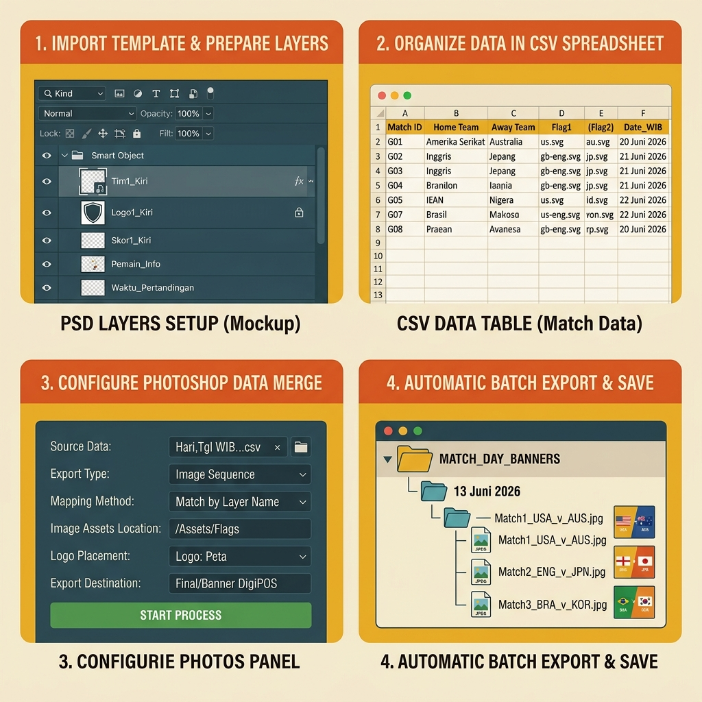
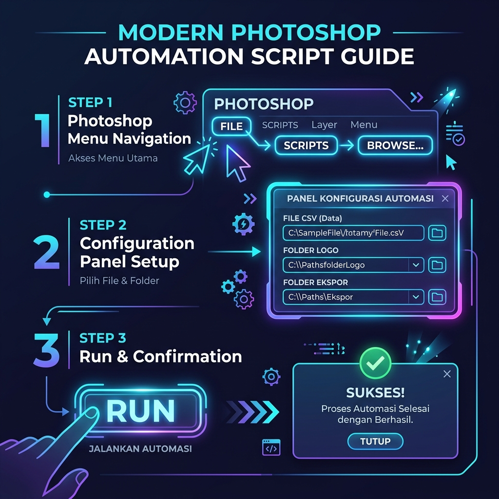

# Tutorial Detail & Presisi: Menggunakan Script Automasi Jadwal



Panduan ini ditulis khusus berdasarkan file kerja yang ada di direktori Anda. Kami akan menjelaskan secara **presisi** bagaimana data dari file CSV Anda masuk ke dalam desain PSD, serta langkah demi langkah eksekusinya.

---

## 📁 Persiapan Awal (Struktur Folder Anda)

Sebelum memulai, pastikan letak file Anda sama seperti di bawah ini:
* **Script Photoshop:** `AutoJadwalLengkap.jsx` (ada di folder root)
* **Data CSV:** `Hari,Tgl WIB,Jam WIB,Tim 1,Tim 2,Logo 1,.csv` (ada di folder root)
* **Folder Logo:** `Peta/` (berisi bendera SVG seperti `us.svg`, `py.svg`, `au.svg`, dll)
* **Folder Ekspor:** `Final/[Nama_Folder_Ekspor]/` (folder kosong tujuan akhir)

---

## 🛠️ Langkah 1: Persiapkan Template PSD Anda

Buka Photoshop dan buka template desain Anda. Sesuaikan nama layer di panel **Layers** Anda agar **persis** seperti daftar di bawah ini:

### A. Bagian Desain Match Kiri:
1. **Layer Teks Tim 1:** Beri nama `Tim1_Kiri` (tipe layer harus TEXT)
2. **Layer Teks Tim 2:** Beri nama `Tim2_Kiri` (tipe layer harus TEXT)
3. **Layer Teks Jadwal:** Beri nama `Jadwal_Kiri` (tipe layer harus TEXT)
4. **Smart Object Logo Tim 1:** Beri nama `Logo1_Kiri` (tipe layer harus Smart Object)
5. **Smart Object Logo Tim 2:** Beri nama `Logo2_Kiri` (tipe layer harus Smart Object)

### B. Bagian Desain Match Kanan:
1. **Layer Teks Tim 1:** Beri nama `Tim1_Kanan` (tipe layer harus TEXT)
2. **Layer Teks Tim 2:** Beri nama `Tim2_Kanan` (tipe layer harus TEXT)
3. **Layer Teks Jadwal:** Beri nama `Jadwal_Kanan` (tipe layer harus TEXT)
4. **Smart Object Logo Tim 1:** Beri nama `Logo1_Kanan` (tipe layer harus Smart Object)
5. **Smart Object Logo Tim 2:** Beri nama `Logo2_Kanan` (tipe layer harus Smart Object)

---

## 📊 Langkah 2: Memahami Bagaimana Data Diproses

Mari kita ambil contoh 2 baris data pertama dari file CSV Anda:
```text
Baris 2 (Match Kiri)  -> Sab,13 Jun 2026,08:00,Amerika Serikat,Paraguay,us.svg,py.svg
Baris 3 (Match Kanan) -> Sab,13 Jun 2026,11:00,Australia,Turki,au.svg,tr.svg
```

Ketika script dijalankan, Photoshop akan memetakan data tersebut ke layer PSD Anda secara otomatis seperti ini:

### 1. Pengisian Match Kiri (Mengambil data Baris 2):
* Layer Teks `Tim1_Kiri` akan diisi: **AMERIKA SERIKAT** (otomatis menjadi huruf besar)
* Layer Teks `Tim2_Kiri` akan diisi: **PARAGUAY**
* Layer Teks `Jadwal_Kiri` akan diisi: **SABTU, 13 JUNI 2026 - PUKUL 08.00 WIB**
* Smart Object `Logo1_Kiri` akan diganti dengan file: `Peta/us.svg`
* Smart Object `Logo2_Kiri` akan diganti dengan file: `Peta/py.svg`

### 2. Pengisian Match Kanan (Mengambil data Baris 3):
* Layer Teks `Tim1_Kanan` akan diisi: **AUSTRALIA**
* Layer Teks `Tim2_Kanan` akan diisi: **TURKI**
* Layer Teks `Jadwal_Kanan` akan diisi: **SABTU, 13 JUNI 2026 - PUKUL 11.00 WIB**
* Smart Object `Logo1_Kanan` akan diganti dengan file: `Peta/au.svg`
* Smart Object `Logo2_Kanan` akan diganti dengan file: `Peta/tr.svg`

---

## 🚀 Langkah 3: Eksekusi Langkah-Demi-Langkah di Photoshop

Ikuti petunjuk ini dengan seksama untuk mulai memproses:



1. Di Photoshop, klik menu **File** > **Scripts** > **Browse...**
2. Jendela Explorer akan terbuka. Arahkan ke folder Anda dan pilih file **[AutoJadwalLengkap.jsx](AutoJadwalLengkap.jsx)**. Klik **Load**.
3. Dialog antarmuka script akan muncul di layar. Isikan pengaturannya **persis** seperti ini:
   * **1. Arahkan File Data & Folder Target:**
     * **Data CSV:** Klik *"Pilih File..."* ➔ Pilih file `Hari,Tgl WIB,Jam WIB,Tim 1,Tim 2,Logo 1,.csv`.
     * **Folder Logo SVG:** Klik *"Pilih Folder..."* ➔ Pilih folder `Peta`.
     * **Folder Export:** Klik *"Pilih Folder..."* ➔ Pilih folder `Final/[Nama_Folder_Ekspor]`.
   * **2. Arahkan Target Layer di PSD:**
     * Secara otomatis, dropdown akan mendeteksi nama layer yang sudah Anda siapkan di Langkah 1. Pastikan pilihan dropdown sudah sesuai (misal dropdown *Teks Tim 1 Kiri* memilih nama layer `Tim1_Kiri`).
   * **3. Pengaturan Format Nama File:**
     * **Awalan (Prefix):** Isi dengan `260612 - FIFA World Cup - ` (atau kosongkan jika ingin menggunakan tanggal saja).
     * **Akhiran (Suffix):** Isi dengan `_869x538px (Pop Up Banner)` (atau kosongkan).
4. Klik tombol **Jalankan Automasi**.

---

## 📂 Langkah 4: Hasil Akhir Hasil Ekspor

Setelah proses automasi berjalan dan selesai (ditandai dengan munculnya pesan sukses beserta durasi detiknya):

1. Buka folder ekspor Anda di komputer: `Final/[Nama_Folder_Ekspor]/`.
2. Anda akan melihat subfolder baru bernama **`13 Juni 2026`** telah dibuat secara otomatis oleh Photoshop.
3. Di dalam folder `13 Juni 2026` tersebut, Anda akan menemukan file gambar:
   `260612 - FIFA World Cup - 13 Juni 2026_869x538px (Pop Up Banner).jpg`
4. Photoshop Anda secara otomatis akan melakukan *revert* sehingga PSD template Anda di layar kembali bersih dan siap digunakan lagi di masa mendatang.
